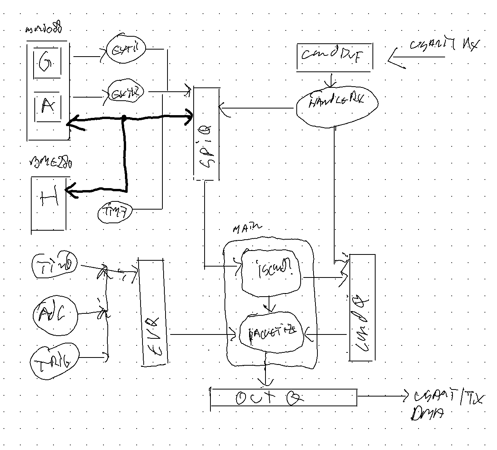

# How to understand this code

The source code is organized in one self-contained directory, src/ with the following files.

    Makefile        self contained build system
    openocd.cfg     configuration for flashing an STM32 over an ST-link programmer

The build system is a simple make file that compiles all the .c files with the appropriate compiler settings and
then links using the .ld script below.  The only depenencies are an arm-none-eabi-gcc compiler suite and either
the st-link tool or openocd. Invocations:

    make            # builds main.elf
    make flash      # uses st-link to burn it into the target device
    make flash2     # uses openocd to do the same
    make clean      # deletes all files that can be regenerated by running make 

The generated binaries are linked using a custom link script

    stm32l432kc.ld  defines memory sizes and absolute addresses of all the built in peripherals of the STM32L432
    sections.ld     included by the above.

The sections.ld files defines a layout consisting of code, initialized data and zeroed data (bss) that are written into flash. 
the reset handler in boot.c copies the data segment to RAM and zeroes out the bss segment before doing anything else. 

The device addresses in the stm32l432kc.ld file are generated by a tool (not included here) that parses an SVD register description
file for the microcontroller at hand. This same SVD file and tool is used to generate a header file with structure definitions for all peripherals
and constants for all their registers, as well as some convenience routines to set bitfields in registers and constants for all the interrupts and
the interrupt vector table.

    stm32l4xx.h     device specific header generated from the SVD.
    cortex_m4.h     a trimmed version of the system file provided by ARM for the core used in the STM32L4xx family.
    vectors.c       the interrupt handler vector table, also generated from the SVD.

The vector table defines the names of the interrupt handlers, which have a default implementation (weak linkage) that can be overriden
by defining a function with the right magic name.   When the device boots it first loads the stack value from the vector table and jumps
to the Reset_Handler, which is defined boot.c. For convenience of debugging, simple handlers for all the system traps are defined in fault.c.

    boot.c      the reset handler
    clock.h     definition of cycleCount(), which is our primary means of timekeeping.
    fault.c     handlers for memory bus and other faults, to print a minimal debug message on the debug console

The resethandler in boot.c sets up the system clock tree, and configures the CPU built in interrupt timer STK to run at the
core frequency of 80MHz.  We use this counter for timekeeping in the cycleCount() function. 

    main.c      the main application, further described below
    output.[ch] functions that format the outgoing messages according to the ICD
    input.[ch]  a facility to parse incoming messages

Low level device drivers:

    nvic.h      functions to enable and disable interrupts in the cortex M4
    gpio2.[ch]  a facility to set up the GPIO pin functions
    spi.[ch]    a driver for SPI handling transactions from a queue over DMA
    usart.h     a driver for an IRQ driven UART

Device independent facilities:

    tprintf.[ch]     a third party printf facility
    binary.h         serializing and deserializing binary messages
    msgq.h           a queue of messages with a fixed maximum size
    ringbuffer.[ch]  a character fifo useful for the usart driver
    runtimer.[ch]    a facility to keep track of how often and how long things run

    bme280.[ch]      definitions for the registers of the BME280 humidity sensor
    bmi08x.h         definitions for the registers of the BMI088 accelerometer and gyroscope
    bmxspi.[ch]      functions to test and configure the BMI and BME devices over SPI. 

# structure of the application

  - initialize pinout, irqs and peripherals
  - initialize and self-test BMI088 and BME380
  - set up irq handlers for accel, gyro, shutter, and periodic events
  - the accel and gyro irqs push SPI transactions on the spiq, which are handled by DMA
  - the other irqs push messages on the event queue evq
  - incoming packets on USART1 are parsed by the USART1 irq.  valid requests are pushed
	on the spiq, invalid ones on the cmdq.
  - the mainloop copies spiq, evq and cmdq to the USART1 outq, which is also handled by DMA
	separating out the normal measurements from the command responses.

## Coding standards

The code is formatted with clang-format, with the settings defined in the .clang-format file in the root of the repo.
This avoids all discussions about whitespace and gives the code a consistent look.   To enforce braces around all if, for 
and while statements occasionally the code has been tidied with 
    clang-tidy-mp-14 -checks='-*,readability-braces-around-statements' -fix-errors main.c 
and has every statement on a separate line.

The code uses no conditional compilations and all constants are enums so they are known to the debugger. 

A tool not included here was used to generatec C definitions in stm32l4xx.h, device addresses stm32l432kc and the vector.c
table from an SVD file provided by ST Microelectronics for their microcontrollers.  

For each device there is a struct, repeated devices are identified, so that eg. USART2 is the same type as USART1, 
named after the first such device, so struct USART1_Type, etc.  The devices addresses are known to the linker so there is no casting-int-to-pointer. 

The constants are prefixed with device and register names so that a visual inspection allows to identify misuse of bitfields.  Constants are 
enums, not #defines and the entire code is (almost) define free and uses no conditional compilation, so you don't have to wonder what is being compiled
when you read the code.

## queues

The mechanism of choice to communicate between interrupt handlers and the main function is a queue or fifo, of which we use three instances.

The Ringbuffer is a circular character buffer, with head and tail pointers wrapping around. It is used by the _putchar() function to be the 
backend to printf and emptied by the console USART2 irq handler.

The MesgQ is a circular buffer of 8 messages with a fixed size and a dynamic length. Instead of pushing into and popping from the queue by value, 
the _head() and _tail() methods give pointers to the elements that will be pushed next and have been popped last.  the push() and pop() methods 
actually advance the head and tail pointers.  If the queue is full or empty head() and tail() return NULL, but for every non-null returned value
push() and pop() must be called exactly once, similar to malloc/free pairs in standard C code. 

A third queue structure used is the SPIQ which has 3 pointers: head, current and tail to form two back-to-back queues:  When an element is pushed 
in at the head, the SPI driver will start the DMA handler and advance the current pointer.  Once the transaction is done, the curr pointer is advanced and
the result is available at the tail. 

The Ringbuffer, MesgQ and SPIQ structures come with their own statically allocated storage space (sizeof elem->buf) for the elements, defined in their headers.

When interrupt handlers are pushing into the same queue they must not pre-empt eachother, meaning they have to run at the same IRQ group priority. 